# Correcting Player Positions
{: .fs-9 }
September 30 2022
{: .fs-6 .fw-300 }

NHL clubs will commonly ice a roster consisting of 18 skaters; 4 lines from 12 forwards **F** and 3 pairs of defenders **D**. A Center **C**, Left Wing **LW**, and Right Wing **RW** form a line. Left Defence **LD** and Right Defence **RD** form a pair. During the even strength portions of a game a team will have 5 skaters on the ice. Predominantly one from each position. While some teams opt to tinker with this set up, we expect the total number of C, LW and RW games played to be balanced. For the 2021/2022 regular season we see this is not the case. 

| Position | Counts |  % |
|:---------|:-------|:-------------------|
D    |15903 |0.336871
C    |15794 |0.334562
LW   |9096|0.192679
RW    |6415|0.135888  

Positions are hardly ever updated once a player joins the league. This leads to some untrustworthy situations. Consider the game between the Ducks and Hawks on March 23rd 2022 (gameId: 2021021018). By the submitted roster sheet, Anaheim played with 1 left wing, 1 right wing and a cast of 10 centers. On top of that, the league doesn't distinguish between left and right defenders. It is commonly brought into question how well a defender fairs playing on their off hand, or how shallow the league's RD depth is. Corrected position labels can settle these questions as well as other roster considerations. Our goal is to assigned one of the five positions to each skater observed in each game for the 2021/2022 regular season.

# Data 

The National Hockey League recorded the following information for every game in the 2021/2022 season:
* **Players**: Who played, for what team and at what position.
* **Events**: A list of events that occurred. Who was involved, when it happened and the integer coordinates where it took place. Note the following agent descriptors derived from the event type in bracket:
    * Faceoff (Faceoff)
    * Shooter (Missed Shot, Blocked Shot, Shot, Goal)
    * Hitter (Hit)
    * Hittee (Hit)
    * Giveaway (Giveaway)
    * Takeaway (Takeaway)
    * Blocker (Blocked Shot)

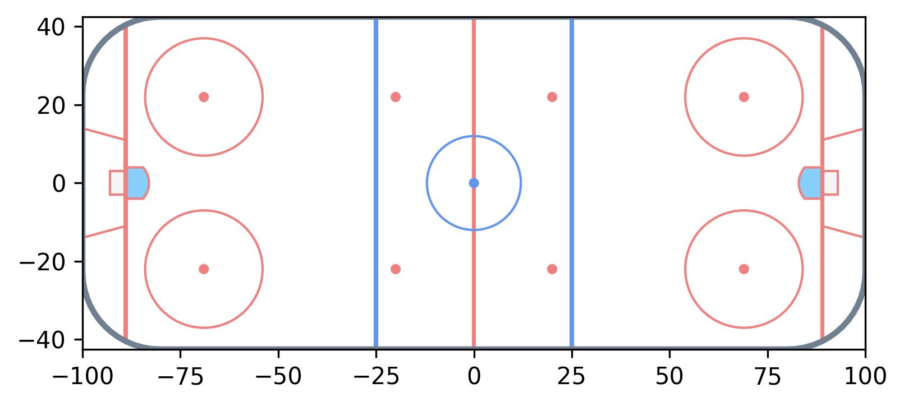
*x, y axes for event coordinates. From a players point of view the opposition's net is always placed on the positive side of the x-axis.*

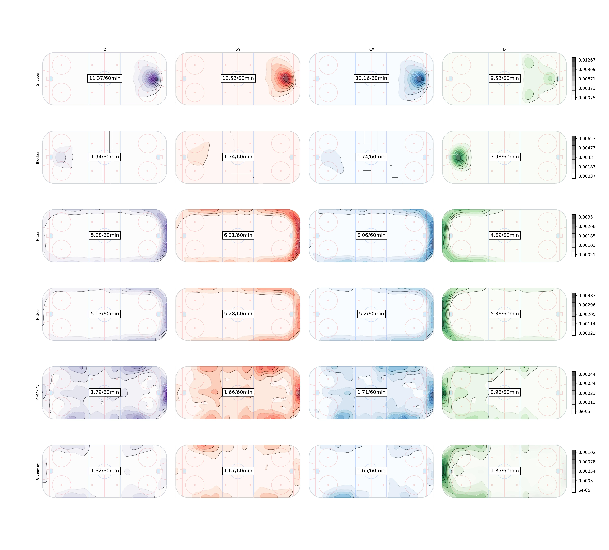
*Rates per sixty minutes for each position in the 2021/2022 season. Contour plots inspired by @IneffectiveMath*

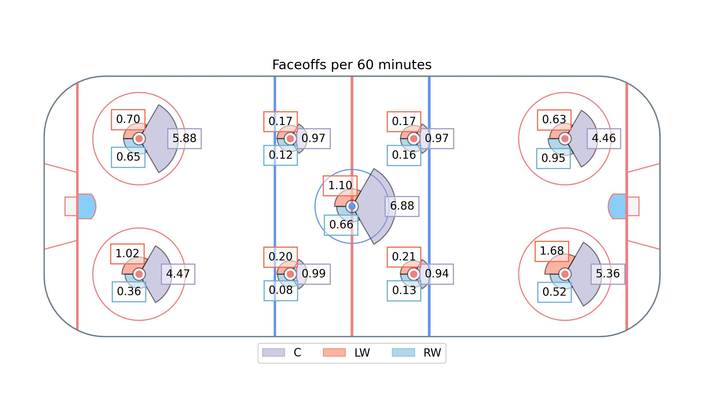

* **Shifts**: Who was on the ice for each second of the game.

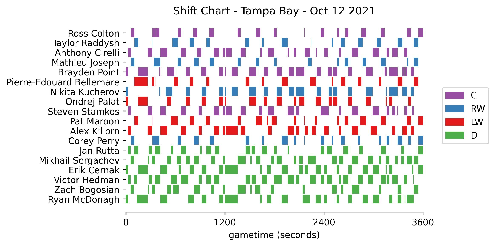
*Tampa Bay's shift data for the opening game. (gameId: 2021020001)*

# Methodology

Instead of clustering all positions at once, we take a top-down hierarchical approach. First partition skaters into forwards and defenders. Then defenders into LD and RD. Then forwards into centers and wingers, and finally wingers into LW and RW. 

## Forwards vs. Defenders

Define the n by n matrix $$\Delta$$ whose $$(i, j)$$-th entry corresponds to the number of seconds teammates $$i$$ and $$j$$ shared on the ice at even strength in a game. The total even strength time on ice for each player is stored in the diagonal entries. $$\Delta$$ can be constructed using the shift data. Let $$B$$ be the binary matrix obtained from the shift chart, then $$\Delta=BB^T$$. From $$\Delta$$, we compute $$\delta$$ by dividing each row by its diagonal entry, so each entry refers to the proportion of a player's time spent with another. For convenience we set the diagonal elements of $$\delta$$ to zero. Each player is always accompanied by 4 teammates so every row will sum to 4. Following this idea, consider just the columns corresponding to defenders, we'll denote this matrix as $$\delta^D$$. The sum of a forward's row will be very close to 2; and very close to 1 for a defender. 

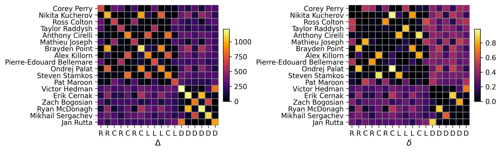
*Tampa Bay's shift data for the opening game of the 2021/2022 season presented in matrix form*

Let binary vector $$x$$ represent our F/D labels where $$x_i = 1$$ indicates the skater is labelled defender. To recover the F/D labels we find the $$x$$ which minimizes $$\sum_{i=1}^{n} \| 2-x_i-\delta^D_{i}x \| $$. I've opted to solve this heuristically, via a steepest ascent local search. While the search is robust to choice of starting location, the initial D and F labels are quite reliable. Neighbourhoods are defined by at most 2 label mutations from the current candidate solution. 

72 instances required swapping defenders to forwards, none in the other direction. One was the result of Robert Burtuzzo moving from D to F after the first period - caught with a sum near 1.6. Which prompts the question, how will we handle mid game roll changes? For simplicity, and issues detailed ahead, we restrict the problem to one label per player in each game. 

## Left vs. Right Defenders

We proceed in a similar fashion to classical expectation-maximization algorithms. EM is an iterative algorithm that is useful for handling missing data. While defender labels are truly missing, the forwards are so messed up it's in our best interest to treat them so.

Defenders are assigned an initial label using a biased coin, 51% in favour of whichever side of the $$y = 0$$ line they appeared more often on in the game. This gentle nudge is only necessary to avoid any manual aliasing afterwards. The algorithm is described below in detail. In the next section we will adjust it to cluster the forwards.

### Step 1. Naive Bayes Classifier

Let $$x_{ij}$$ be a feature vector encoding the counts of each action $$a$$ at each coordinate $$(x,y)$$ conducted by player $$i$$ in game $$j$$. For example, in the $$j$$-th game of the season, player $$i$$ recorded one shot at center ice, thus $$x_{ijk}=1$$ where $$k=(\text{Shooter},(0,0))$$ otherwise 0. We can think of each $$x_{ijk}$$ as generated independently from a poisson distribution with mean $$n_{ij}\theta_{pk}$$ where $$p$$ identifies the player's position. Parameter $$\theta_{pk}$$ defines the *rate* at which $$k$$ occurs per 60 minutes. $$n_{ij}$$ is the constant *exposure* or player $$i$$'s ice time in game $$j$$ divided by 60 minutes. Then we can model the entire population of defenders as a multivariate poisson mixture with two components for LD and RD.

The conditional likelihood of $$x_{ij}$$ given it has label LD is:
    
$$f(x_{ij} | p=LD) = \prod_{k=1}^K \frac{(n_{ij}\theta_{LD,k})^{x_{ijk}}e^{-n_{ij}\theta_{LD,k}}}{x_{ijk}!}$$

Following bayes rule the posterior likelihood is:
    
$$f(LD | x_{i,j}) \propto f(LD) f(x_{ij} | LD)$$

where $$f(LD)$$ is the prior probability. Prior to any available information, both positions are considered to be equally likely, so $$f(RD) = f(LD) = .5$$.

Finally, the log posterior odds of the two positions is:

$$
\begin{aligned}
\alpha_{i,j} &= \log \frac{f(LD | x_{i,j})}{f(RD | x_{i,j})} \\
&= \sum x_{ijk} \log \frac{\theta_{LD,k}}{\theta_{RD,k}} + n_{i,j} \sum(\theta_{RD,k} - \theta_{LD,k})\\
\end{aligned}
$$

which determines cluster membership. A positive $$\alpha_{i,j}$$ means the player is more likely to be LD. 

The log odds require estimating the rate parameters, which in itself calls for existing labels. A typical solution tumbles between the two calculations, with each update hopefully bringing us closer to convergence. So far we've only utilized event data. A satisfying solution will pair both event and shift sources, addressed in step 2.

---
### Estimating the rate parameters

It can be helpful to visualize the $$\theta_{p,k}$$'s as a set of grids for each action, seen previously with the contour plots.

{:style="counter-reset:step-counter 0"}
1. For each position and action store the total counts in matrix $$M_p$$, whose rows and columns coincide with the (x,y) coordinates.	

Faceoffs are omitted for defenders. None were recorded, nor do we except them to hold any information for the position. 

{:style="counter-reset:step-counter 1"}
2. Add the matrix corresponding to its mirrored position flipped along the $$y=0$$ entries to $$M_p$$. Add corresponding total exposure times $$N_p$$ as well.
	$$M_{LD}'[x,y]=M_{LD}[x,y] + M_{LD}[x,-y]$$ 

	$$N_{LD}'=N_{LD} + N_{RD}$$ 	

This step enforces symmetry between the two positions and sets any action on the $$y=0$$ line to have zero sway. Now two shots at $$(x,-10)$$ and $$(x,10)$$ will cancel out. It has the added benefit of equating the total rates for each action, setting the terms $$\sum(\theta_{RD,k} - \theta_{LD,k}) = 0$$. If we were given an event at an undisclosed location it provides no evidence. This is a wanted consequence, as it prevents clustering based on archetypes. For example "stay at home" defenders tend to have high hit and block rates but low shooting rates. The opposite is true for "offensive" defenders. 

{:style="counter-reset:step-counter 2"}
3. Apply a Kernel Smoothing Method to each matrix. 

To avoid zero frequency problems we add a pseudo count of $$1 \times \frac{N_p}{N_{\text{base class}}}$$ to each count (The fraction preserves a one to one ratio after calculating rates). Afterwards a kernel smoothing method is applied to $$M_p'$$ to incorporate spatial dependency amongst $$\theta$$'s. The main idea here is to apply regularization techniques commonly found in generalized additive models while retaining the benefits of our naive bayes classifier, predominantly speed.

At the moment I've using a gaussian kernel with $$\sigma = 5$$ based on visual inspection. A more principled approach, such as selection through cross validation, is left to future work. However, current results have been impartial to alternative choices. It will be worth looking into adaptive kernels, whose bandwidth fluctuates to accommodate sparse regions of the rink. Recall our log odds formula; our aim isn't an accurate estimate of each position's rate, but of the ratio between classes. It is the ratio whichh dictates the separation of classes. When count data is sparse for either position the estimated ratio can be highly variable and our pseudo count - which in some way influences the results like a prior - may have a stronger than intended effect. 

{:style="counter-reset:step-counter 3"}
4. Obtain the rates per 60 minutes by dividing each count by exposure $$N_{p}'$$

---

### Step 2. Pairwise Comparisons

Due to the nature of the problem, whenever two teammates are on the ice we wish to compare them to determine who gets what label. The Bradley-Terry model is a standard approach to model pairwise comparisons. It's commonly used in sports to model team strength from W-L records. The Davidson model is an extension to incorporate ties. Here we'll treat winning as being assigned LD while sharing the ice with a RD. A tie refers to both players sharing the same label. The probabilities for each outcome is given as:

- $$ p(i=LD, j=RD) = \frac{e^{\alpha_i}}{e^{\alpha_i}+e^{\alpha_j}+e^{z + .5(\alpha_i+\alpha_j)}}$$

- $$ p(i=j) = \frac{e^{z + .5(\alpha_i+\alpha_j)}}{e^{\alpha_i}+e^{\alpha_j}+e^{z + .5(\alpha_i+\alpha_j)}}$$

- $$ p(i=RD, j=LD) = \frac{e^{\alpha_j}}{e^{\alpha_i}+e^{\alpha_j}+e^{z + .5(\alpha_i+\alpha_j)}}$$

Where $$z \in (-\infty,\infty)$$ determines the probability of a tie. We set $z=0$ which seems reasonable enough for our purposes. $$\alpha_i$$ represents player $$i$$'s "strength" or evidence for playing on the left side. The $$\alpha$$'s are usually fit to the response data, but for this clustering problem we take them to be the log odds computed previously. 

Since pairwise comparisons only occur between teammates and only across one game, we can compartmentalize the labelling process.
We find labels $$l$$ such that log likelihood of our pairwise comparison model weighted by the time each pair spent on the ice is maximized:

$$ \sum_{i<j}\Delta[i,j]*log(p(i=l_i, j=l_j))$$

Furthermore, we impose a constraint on $l$ such that the size of the majority can only surpass the minority class by 1. This enforces our expectations of roster construction.
The most defenders a team has iced this season is 7; which has 70 possible configurations of LD & RD. This makes brute force is a viable option.

Step 1 and 2 are repeated until the labels converge or capped at a maximum number of iterations.

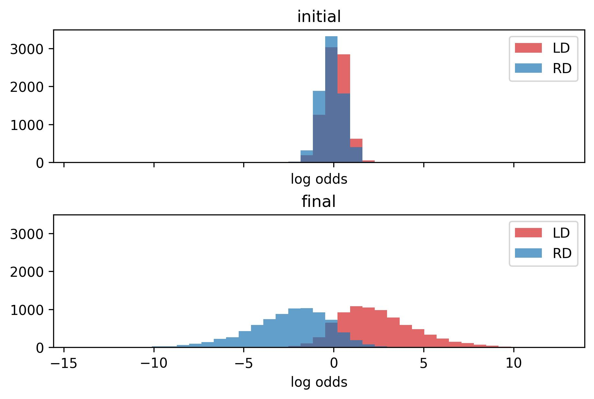
*The histogram for strength terms between left and right defenders.*

---

### Incorporating Correlation

Event data is like splicing a video stream into snapshots of *key* action moments. *Key* moments - which might be less discriminative than the times a player is simply floating around - are rare enough a single game's worth doesn't ensure success. The most extreme example being Buffalo's entire D core registering a single even strength event in (gameId: 2021020566); Boston's Curtis Lazar was generous enough to hit Casey Fitzgerald. Conversely, events can be misleading. It's not uncommon for players to have "off" games while their team does not provide enough to mitigate the faulty evidence. 

The good news is that we don't have to restrict ourselves to one game worth of information. It is reasonable to expect that players or pairs will take the same roles throughout the season. Say a pair play 20 games in one orientation, how much evidence do you need to be convinced they swapped roles for the next game? Typically for data with structural correlations, random effects are added to the model. To stay within our framework, I've decided to apply a weighted aggregate to feature vectors. Each $$x_{i,j} = \sum_{i',j'}w_{i',j'}x_{i,j}$$ where $$w$$ should resemble our intuition of which responses are correlated. This leads to a bevy of options. For example a weighting can be proportional to the ice time given to the player in each game. This results in players having a constant $$\alpha$$ throughout the season. It would be equivalent to a set ranking for role priority. Another option is to only weigh in games where the player spends the majority of the time with common linemates. Lines are determined by the graph constructed from $$\delta$$. Let an edge $${i,j}$$ exist if $$\delta[i,j]$$ and $$\delta[j,i]$$ are greater than some threshold. Then all disconnected components which are triangles form F lines, all arcs form D pairs. For extra measure, restrict label conflicts within each component.

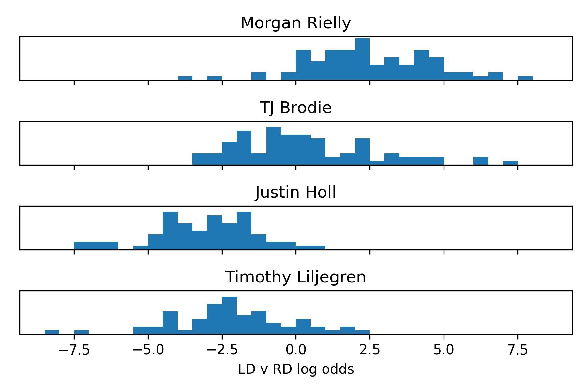
*Histogram of log odds for 4 prominent members of Toronto's Defence. Notice Morgan Rielly, who I contest played every game as LD strictly due to seniority, has some games suggesting otherwise. His partner for most of the year, TJ Brodie plays a flex role but indulges in the left side whenever the pair is split.*

Let's compare the results Toronto's defence with and without aggregating. I prefer the latter, which exhibits a cleaner separation at the cost of paving over any intricacies. 

<table>
   <tr>
      <th></th>
      <th colspan=2>Single Game Strength</th>
      <th colspan=3>Season Strength Aggregate</th>
      <th colspan=3>Linemate Strength Aggregate</th>
   </tr>
   <tr>
      <th>Name</th>
      <th>LD</th>
      <th>RD</th>
      <th>$$\alpha$$</th>
      <th>LD</th>
      <th>RD</th>
      <th>LD</th>
      <th>RD</th>
   </tr>
<tr>
	<td>Jake Muzzin</td>
	<td>47</td>
	<td>0</td>
	<td>3.57</td>
	<td>47</td>
	<td>0</td>
	<td>47</td>
	<td>0</td>
</tr>
<tr>
	<td>Kristians Rubins</td>
	<td>3</td>
	<td>0</td>
	<td>3.3</td>
	<td>3</td>
	<td>0</td>
	<td>3</td>
	<td>0</td>
</tr>
<tr>
	<td>Mark Giordano</td>
	<td>19</td>
	<td>1</td>
	<td>2.97</td>
	<td>20</td>
	<td>0</td>
	<td>19</td>
	<td>1</td>
</tr>
<tr>
	<td>Morgan Rielly</td>
	<td>76</td>
	<td>6</td>
	<td>2.32</td>
	<td>82</td>
	<td>0</td>
	<td>82</td>
	<td>0</td>
</tr>
<tr>
	<td>Carl Dahlstrom</td>
	<td>3</td>
	<td>0</td>
	<td>2.07</td>
	<td>3</td>
	<td>0</td>
	<td>3</td>
	<td>0</td>
</tr>
<tr>
	<td>Rasmus Sandin</td>
	<td>43</td>
	<td>8</td>
	<td>1.25</td>
	<td>49</td>
	<td>2</td>
	<td>49</td>
	<td>2</td>
</tr>
<tr>
	<td>Travis Dermott</td>
	<td>23</td>
	<td>20</td>
	<td>0.32</td>
	<td>19</td>
	<td>24</td>
	<td>20</td>
	<td>23</td>
</tr>
<tr>
	<td>TJ Brodie</td>
	<td>28</td>
	<td>54</td>
	<td>0.31</td>
	<td>23</td>
	<td>59</td>
	<td>23</td>
	<td>59</td>
</tr>
<tr>
	<td>Ilya Lyubushkin</td>
	<td>2</td>
	<td>29</td>
	<td>-1.47</td>
	<td>0</td>
	<td>31</td>
	<td>1</td>
	<td>30</td>
</tr>
<tr>
	<td>Timothy Liljegren</td>
	<td>3</td>
	<td>58</td>
	<td>-2.08</td>
	<td>0</td>
	<td>61</td>
	<td>0</td>
	<td>61</td>
</tr>
<tr>
	<td>Justin Holl</td>
	<td>0</td>
	<td>69</td>
	<td>-2.85</td>
	<td>0</td>
	<td>69</td>
	<td>0</td>
	<td>69</td>
</tr>
<tr>
	<td>Alex Biega</td>
	<td>0</td>
	<td>2</td>
	<td>-3.84</td>
	<td>0</td>
	<td>2</td>
	<td>0</td>
	<td>2</td>
</tr>
</table>
  
## Centers vs. Wingers

Some slight adjustments are made to accommodate forwards. At each pass of the algorithm forwards are clustered into center and winger groups, then wingers into left and right. LW and RW labels are assigned similarly to defenders. Separating out centers is a bit different and we detail the changes below.

- Faceoffs are included, but since they only occur in 9 locations we do not apply any KDE, though there is merit to jacking up the pseudo count to balance its effect against the other smoothed over actions.

- When reflecting the counts, mirror center counts onto themselves.

- Normalize the count rates for each action except Faceoffs. Essentially this creates a debt which centers can easily work out of by taking faceoffs. Thus if no actions are taken, the player is more likely to be a winger. 

- Calculate the log odds between center and the two winger classes as: 

$$\begin{aligned}
\beta_{i,j} &= log \frac{f(C | x_{i,j})}{f(LW | x_{i,j})+f(RW | x_{i,j})} \\
&= log\frac{\prod e^{-n_{i,j}\theta_{C,k}}(n_{i,j}\theta_{C,k})^{x_ijk}}{\prod e^{-n_{i,j}\theta_{LW,k}}(n_{i,j}\theta_{LW,k})^{x_ijk} + \prod e^{-n_{i,j}\theta_{RW,k}}(n_{i,j}\theta_{RW,k})^{x_ijk}}\\
&= \sum x_{ijk}log \theta_{C,k} - n_{i,j} \sum\theta_{C,k} - log (\prod e^{-n_{i,j}\theta_{LW,k}}\theta_{LW,k}^{x_ijk} + \prod e^{-n_{i,j}\theta_{RW,k}}\theta_{RW,k}^{x_ijk})\\
&= \sum x_{ijk}log \theta_{C,k} - n_{i,j} \sum\theta_{C,k} - log (\prod e^{-n_{i,j}\theta_{LW,k}}(\prod\theta_{LW,k}^{x_ijk} + \prod\theta_{RW,k}^{x_ijk}))\\
&= \sum x_{ijk}log \theta_{C,k} - n_{i,j} \sum(\theta_{C,\text{Faceoffs}} - \theta_{LW,\text{Faceoffs}}) - log (e^{\sum x_{ijk}log \theta_{LW,k}} + e^{\sum x_{ijk}log \theta_{RW,k}})\\
\end{aligned}
$$

- Calculate the log likelihood using the Davidson-Luce Model for groupwise comparisons [1]. Compare every combination of three forwards. Once again weigh by shared ice time. Limit the amount of C labels assigned in one game between $$\lfloor \frac{\text{# of forwards}}{3}\rfloor$$ and $$\lceil \frac{\text{# of forwards}}{3}\rceil$$.

    - $$ p(l_i=C, l_j=W, l_k=W) \propto e^{\beta_i}$$
    - $$ p(l_i=W, l_j=C, l_k=W) \propto e^{\beta_j}$$
    - $$ p(l_i=W, l_j=W, l_k=C) \propto e^{\beta_k}$$
    - $$ p(l_i=C, l_j=C, l_k=W) \propto e^{z_2 + \frac{1}{2}(\beta_i + \beta_j)}$$
    - $$ p(l_i=C, l_j=W, l_k=C) \propto e^{z_2 + \frac{1}{2}(\beta_i + \beta_k)}$$
    - $$ p(l_i=W, l_j=C, l_k=C) \propto e^{z_2 + \frac{1}{2}(\beta_j + \beta_k)}$$
    - $$ p(l_i=W, l_j=W, l_k=W) \propto e^{z_3 + \frac{1}{3}(\beta_i + \beta_j + \beta_k)}$$
    - $$ p(l_i=C, l_j=C, l_k=C) \propto e^{z_3 + \frac{1}{3}(\beta_i + \beta_j + \beta_k)}$$

---

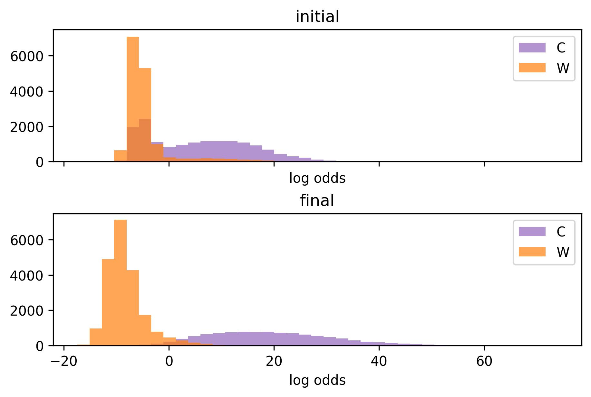
*The histogram for log odds between center and winger. The mixture clearly exhibits two components, it's easy to spot the pretenders immediately. The final distribution for centers is wide due to the weight of faceoffs. Modelling faceoff rates as a poisson distribution may not be the best choice, since coaches try to allocate them based on preference.*

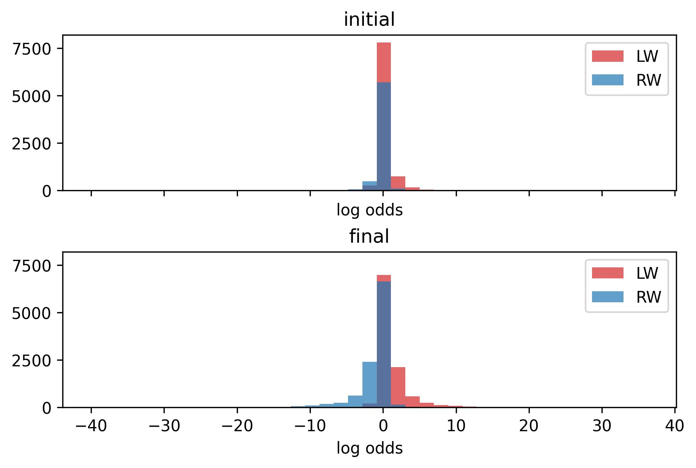
*The histogram for log odds between left and right wingers, a sad site.*

Once again, let's look at the results for Toronto. The winger labels are suspect until we aggregate games. Season and linemate weightings tend to agree. When they do not, manual inspection only favours the latter when the line has played plenty of games together. 

<table>
<tr>
	<th></th>
	<th colspan=3>Single Game Strength</th>
	<th colspan=5>Season Strength Aggregrate</th>
	<th colspan=3>Linemate Strength Aggregrate</th>
</tr>
<tr>
	<th>Name</th>
	<th>C</th>
	<th>LW</th>
	<th>RW</th>
	<th>$$\beta$$</th>
	<th>$$\alpha$$</th>
	<th>C</th>
	<th>LW</th>
	<th>RW</th>
	<th>C</th>
	<th>LW</th>
	<th>RW</th>
</tr>
<tr>
	<td>Auston Matthews</td>
	<td>73</td>
	<td>0</td>
	<td>0</td>
	<td>27.57</td>
	<td>2.47</td>
	<td>73</td>
	<td>0</td>
	<td>0</td>
	<td>73</td>
	<td>0</td>
	<td>0</td>
</tr>
<tr>
	<td>John Tavares</td>
	<td>79</td>
	<td>0</td>
	<td>0</td>
	<td>22.8</td>
	<td>1.01</td>
	<td>79</td>
	<td>0</td>
	<td>0</td>
	<td>79</td>
	<td>0</td>
	<td>0</td>
</tr>
<tr>
	<td>David Kampf</td>
	<td>82</td>
	<td>0</td>
	<td>0</td>
	<td>19.31</td>
	<td>0.95</td>
	<td>82</td>
	<td>0</td>
	<td>0</td>
	<td>82</td>
	<td>0</td>
	<td>0</td>
</tr>
<tr>
	<td>Jason Spezza</td>
	<td>61</td>
	<td>1</td>
	<td>9</td>
	<td>9.54</td>
	<td>-2.61</td>
	<td>70</td>
	<td>0</td>
	<td>1</td>
	<td>62</td>
	<td>3</td>
	<td>6</td>
</tr>
<tr>
	<td>Brett Seney</td>
	<td>2</td>
	<td>0</td>
	<td>0</td>
	<td>0.55</td>
	<td>1.72</td>
	<td>1</td>
	<td>1</td>
	<td>0</td>
	<td>2</td>
	<td>0</td>
	<td>0</td>
</tr>
<tr>
	<td>Colin Blackwell</td>
	<td>11</td>
	<td>0</td>
	<td>8</td>
	<td>-3.1</td>
	<td>-1.58</td>
	<td>5</td>
	<td>0</td>
	<td>14</td>
	<td>9</td>
	<td>0</td>
	<td>10</td>
</tr>
<tr>
	<td>Nicholas Abruzzese</td>
	<td>1</td>
	<td>5</td>
	<td>3</td>
	<td>-4.95</td>
	<td>0.03</td>
	<td>1</td>
	<td>7</td>
	<td>1</td>
	<td>1</td>
	<td>6</td>
	<td>2</td>
</tr>
<tr>
	<td>Kirill Semyonov</td>
	<td>1</td>
	<td>1</td>
	<td>1</td>
	<td>-5.77</td>
	<td>0.28</td>
	<td>0</td>
	<td>3</td>
	<td>0</td>
	<td>1</td>
	<td>1</td>
	<td>1</td>
</tr>
<tr>
	<td>Alexander Kerfoot</td>
	<td>12</td>
	<td>53</td>
	<td>17</td>
	<td>-6.24</td>
	<td>0.7</td>
	<td>10</td>
	<td>72</td>
	<td>0</td>
	<td>12</td>
	<td>54</td>
	<td>16</td>
</tr>
<tr>
	<td>Alex Steeves</td>
	<td>0</td>
	<td>0</td>
	<td>3</td>
	<td>-6.31</td>
	<td>-0.27</td>
	<td>2</td>
	<td>0</td>
	<td>1</td>
	<td>0</td>
	<td>0</td>
	<td>3</td>
</tr>
<tr>
	<td>Michael Amadio</td>
	<td>0</td>
	<td>1</td>
	<td>2</td>
	<td>-6.35</td>
	<td>-0.99</td>
	<td>0</td>
	<td>0</td>
	<td>3</td>
	<td>0</td>
	<td>3</td>
	<td>0</td>
</tr>
<tr>
	<td>Kyle Clifford</td>
	<td>1</td>
	<td>15</td>
	<td>7</td>
	<td>-6.73</td>
	<td>0.22</td>
	<td>3</td>
	<td>15</td>
	<td>5</td>
	<td>1</td>
	<td>19</td>
	<td>3</td>
</tr>
<tr>
	<td>Wayne Simmonds</td>
	<td>0</td>
	<td>31</td>
	<td>41</td>
	<td>-7.51</td>
	<td>-0.23</td>
	<td>1</td>
	<td>11</td>
	<td>60</td>
	<td>0</td>
	<td>9</td>
	<td>63</td>
</tr>
<tr>
	<td>Pierre Engvall</td>
	<td>4</td>
	<td>43</td>
	<td>31</td>
	<td>-7.94</td>
	<td>0.17</td>
	<td>0</td>
	<td>59</td>
	<td>19</td>
	<td>4</td>
	<td>44</td>
	<td>30</td>
</tr>
<tr>
	<td>Nicholas Robertson</td>
	<td>0</td>
	<td>7</td>
	<td>3</td>
	<td>-7.99</td>
	<td>-0.04</td>
	<td>0</td>
	<td>8</td>
	<td>2</td>
	<td>0</td>
	<td>9</td>
	<td>1</td>
</tr>
<tr>
	<td>Joey Anderson</td>
	<td>0</td>
	<td>1</td>
	<td>4</td>
	<td>-8.13</td>
	<td>-0.19</td>
	<td>0</td>
	<td>0</td>
	<td>5</td>
	<td>0</td>
	<td>0</td>
	<td>5</td>
</tr>
<tr>
	<td>Nick Ritchie</td>
	<td>0</td>
	<td>25</td>
	<td>8</td>
	<td>-8.94</td>
	<td>0.48</td>
	<td>0</td>
	<td>33</td>
	<td>0</td>
	<td>0</td>
	<td>33</td>
	<td>0</td>
</tr>
<tr>
	<td>Ondrej Kase</td>
	<td>0</td>
	<td>11</td>
	<td>39</td>
	<td>-9.21</td>
	<td>-0.41</td>
	<td>0</td>
	<td>3</td>
	<td>47</td>
	<td>0</td>
	<td>2</td>
	<td>48</td>
</tr>
<tr>
	<td>William Nylander</td>
	<td>1</td>
	<td>26</td>
	<td>54</td>
	<td>-9.34</td>
	<td>-0.54</td>
	<td>0</td>
	<td>0</td>
	<td>81</td>
	<td>1</td>
	<td>16</td>
	<td>64</td>
</tr>
<tr>
	<td>Ilya Mikheyev</td>
	<td>0</td>
	<td>35</td>
	<td>18</td>
	<td>-9.82</td>
	<td>0.25</td>
	<td>0</td>
	<td>38</td>
	<td>15</td>
	<td>0</td>
	<td>52</td>
	<td>1</td>
</tr>
<tr>
	<td>Michael Bunting</td>
	<td>0</td>
	<td>51</td>
	<td>28</td>
	<td>-10.72</td>
	<td>0.21</td>
	<td>0</td>
	<td>77</td>
	<td>2</td>
	<td>0</td>
	<td>76</td>
	<td>3</td>
</tr>
<tr>
	<td>Mitchell Marner</td>
	<td>0</td>
	<td>21</td>
	<td>51</td>
	<td>-11.3</td>
	<td>-0.18</td>
	<td>0</td>
	<td>1</td>
	<td>71</td>
	<td>0</td>
	<td>0</td>
	<td>72</td>
</tr>
</table>

## Concluding Remarks

A short summary of our clustering algorithm:

    1. Use Kernel Density Estimation to supply event rates for our mixture model.
    2. Obtain membership odds, which are then airdropped into a Group Comparison model weighted by shift data
    3. Find memberships by brute forcing the constrained optimization problem. 

There remains a lot to be tinkered with. Adding penalties, separating wrap-arounds or other secondary types from shots, partitioning the rink's grid by zone before smoothing, possibly lasso regularization... I suspect most to be fruitless. The main sticking point is distilling winger labels. Diminishing the additive smoothing or pushing the KDE to produce more discriminative ratios leads to similar yet murky results. Forwards tend to cross over the $$y = 0$$ line enough to require more spatial sampling for consistency. The only way I've found to overcome this is by feeding season data into the single game strength terms, in perhaps the most unprincipled manner. I subsist this provides close to ideal results without manual inspection. It seems adequate if your goal is to get positional eligibility status for fantasy hockey.

You can reach me on twitter @yimmymcbill if you have suggestions!  

## References
[1] Firth, D., Kosmidis, I., & Turner, H. (2019). Davidson-Luce model for multi-item choice with ties. arXiv preprint arXiv:1909.07123.

---

### Defender Results

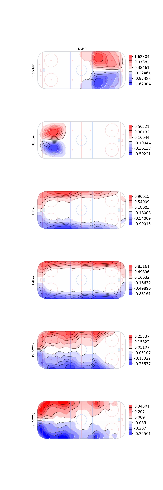
*The final estimates for the coefficient-like terms for the event counts in the posterior odds ratio formula. The log of the LD over RD rate parameters.*

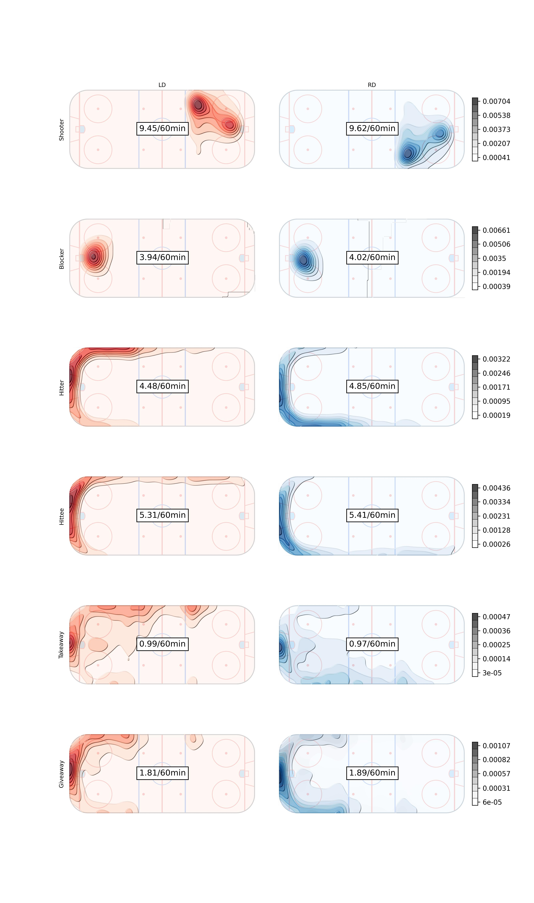
*The final Rates per sixty minutes for left and right defenders*

---

### Forward Results

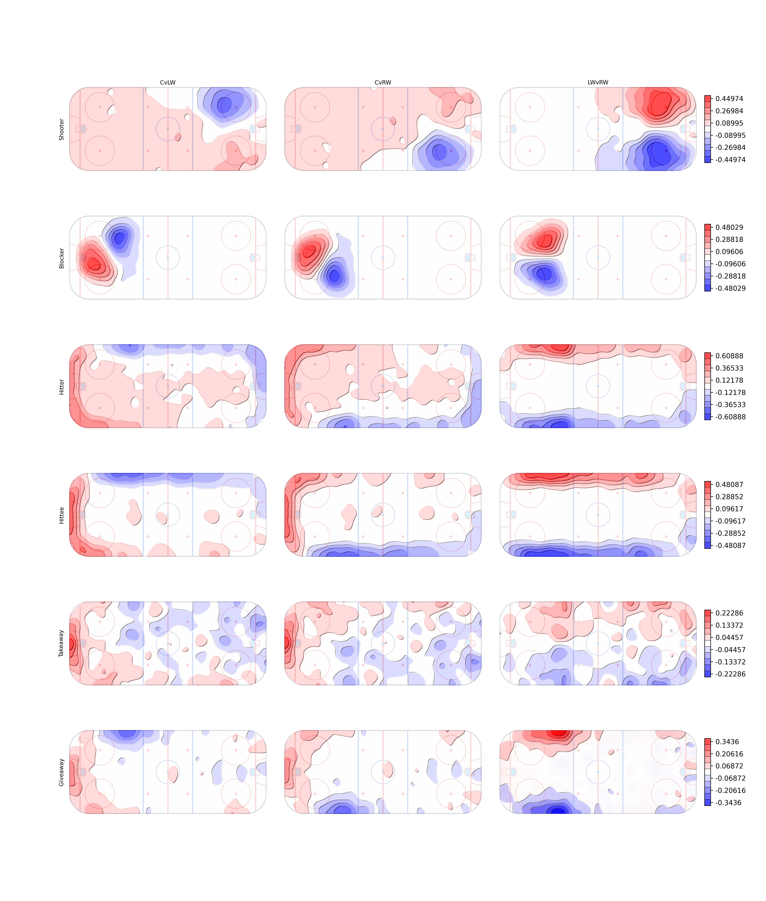
*The final estimates for the coefficient-like terms for the event counts in the posterior odds ratio formula between two of the three forward positions.*

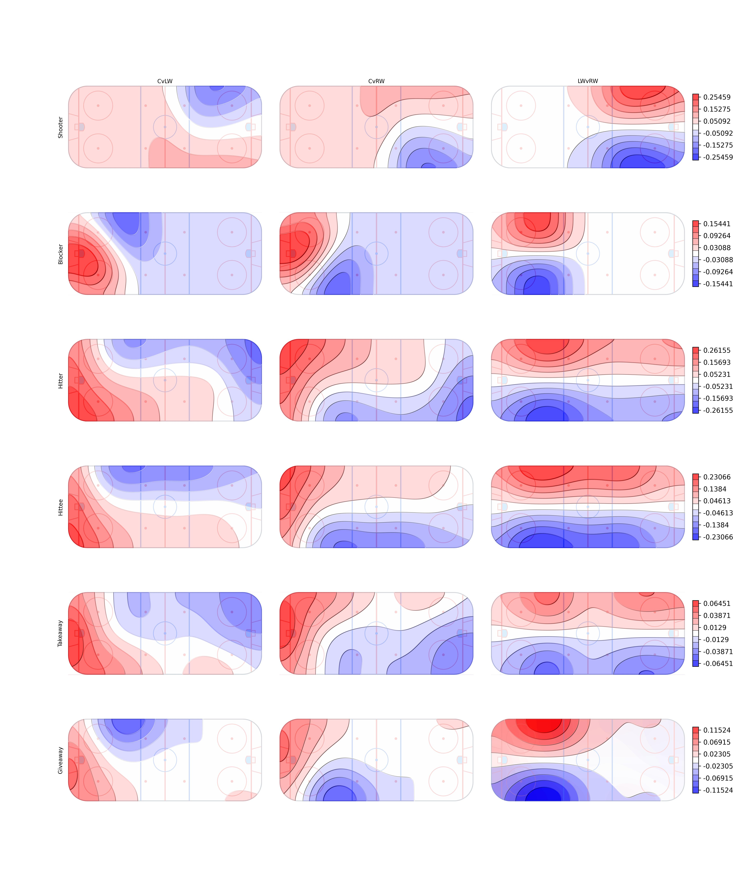
*An example using Gaussian KDE with $$\sigma$$ cranking up to 20.*

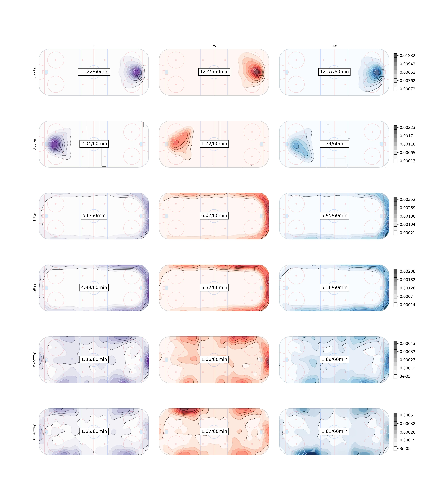
*The final Rates per sixty minutes for all forward positions*

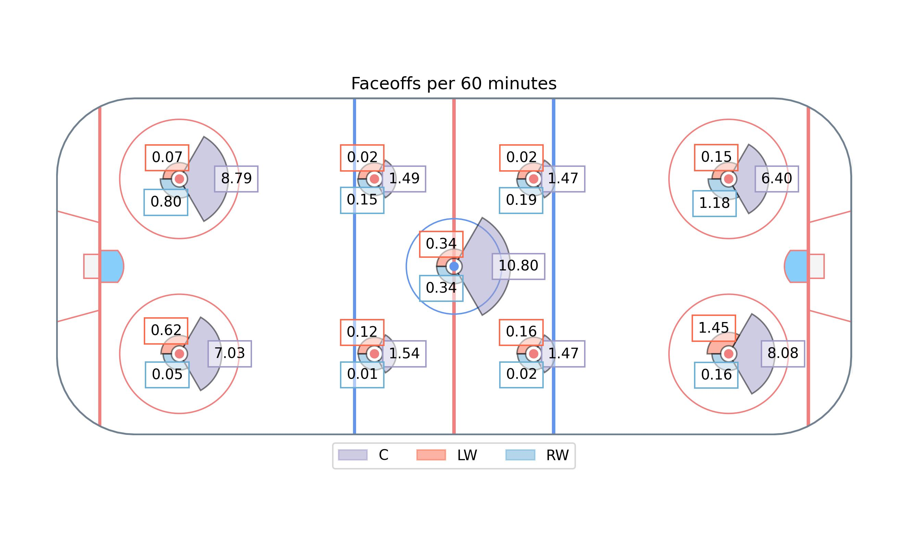

---

## Forwards Labelled as Defenders

|playerId|fullName|gameId|
|--------|--------|------|
|8474145|Robert Bortuzzo|2021020311|
|8474722|Luke Witkowski|2021020939|
|8475625|Matt Irwin|2021020469|
|8476372|Nick Seeler|2021020739|
|8476470|Nathan Beaulieu|2021020314|
|8476779|Brad Hunt|2021021152|
|8477073|Kurtis MacDermid|2021020299, 2021020321, 2021020399, 2021020415, 2021020433, 2021020490, 2021020580, 2021020591, 2021020606, 2021020622, 2021020634, 2021020641, 2021020663, 2021020805, 2021020826, 2021020836, 2021020857, 2021020871, 2021020886, 2021020962, 2021020982, 2021021119|
|8477335|Kyle Burroughs|2021021175, 2021021192|
|8477419|Mason Geertsen|2021020043, 2021020056, 2021020090, 2021020226, 2021020327, 2021020360, 2021020422, 2021020529, 2021020586, 2021020631, 2021020666, 2021020817, 2021020875, 2021020904, 2021020921, 2021020935, 2021020966, 2021020989, 2021021005, 2021021074, 2021021274|
|8477851|Jordan Oesterle|2021020472, 2021021101, 2021021222, 2021021235|
|8477938|Haydn Fleury|2021020967|
|8478013|Jake Walman|2021020394, 2021020547|
|8478017|Mark Friedman|2021021029|
|8479372|Josh Mahura|2021020907|
|8479376|Victor Mete|2021021199|
|8479439|Jacob MacDonald|2021020105, 2021020122, 2021020145|
|8479639|Dylan Coghlan|2021021073, 2021021126|
|8480160|Radim Simek|2021021171|
|8480884|Calen Addison|2021020344, 2021020599|
|8481003|Hunter Drew|2021021285, 2021021307|
|8482624|Daniil Miromanov|2021020100|
